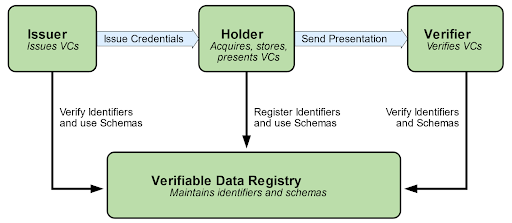
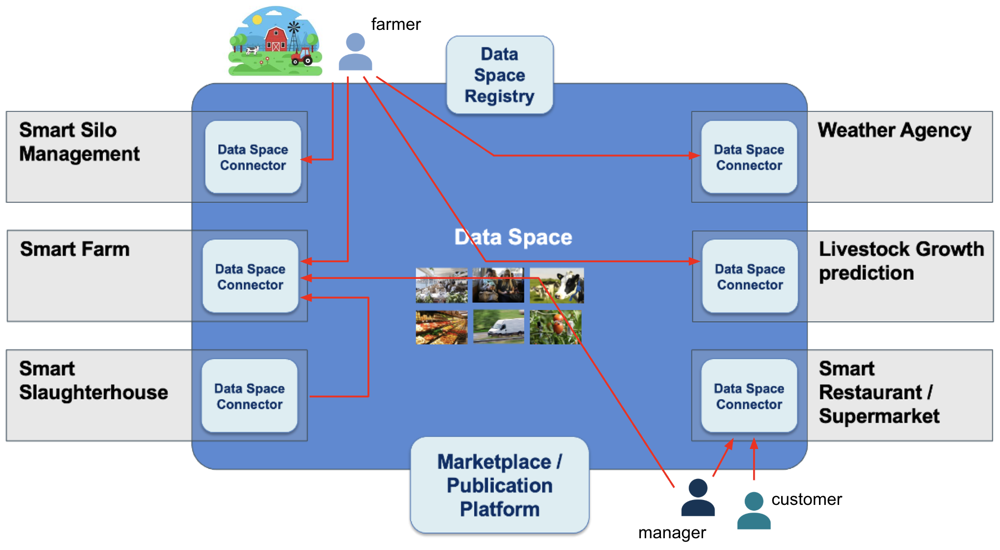

# FIWARE Data Spaces

## Overview

Data Spaces constitute one of the pillars of the European Strategy for Data. A Data Space is defined as a governance-based ecosystem that facilitates the creation of value around the use of data access, processing, presentation, and interpretation services, while preserving trust among the parties, the sovereignty of each participant, and an agile and seamless experience in carrying out the processes associated with the provision, publication, discovery, contracting, and use of data and data services.

## Basic Concepts

### Products, Services and Resources

Any participant in a data space may act in the role of product provider, product consumer, or both. A product comprises a set of data services: services accessible through APIs (Application Programming Interfaces) at specific internet endpoints that enable access to or processing of data (including services whose invocation entails the execution of actions), or end-user application services that, through web tools (dashboards, maps, VR-based interfaces, natural-language chatbots based on generative AI, etc.), facilitate the management, visualization, and interpretation of data, as well as the invocation of processing services, by end users. The services linked to a given product may require the provisioning of resources for their execution, both in the cloud (e.g., compute and storage capacity) and in the field (e.g., gateways, devices). Some of these resources (e.g., devices) may need to be provisioned by each of the organizations that has acquired the right to consume the services.

The complexity of the products provided in a data space can vary over a very wide range, from simple products comprising access to a specific dataset to sophisticated products corresponding to complete systems that implement multiple data access or data processing services via APIs, as well as applications intended for end users that facilitate access to, processing, visualization, or interpretation of data.

Thus, for example, within a data space for the agri-food sector, we may have products that simply offer access to weather data or historical data related to a farm's use of pesticides, but also sophisticated products such as a complete irrigation management system for citrus farms or a fruit growth monitoring system. Each of these systems may cover a broad set of services accessible via APIs (both for access to current and historical measurement data, and for access to predictions regarding the ideal time for irrigation or fruit harvesting) or linked to applications (dashboards, monitoring maps, prediction maps, chatbots, etc.) that facilitate the management, visualization, and interpretation of data, as well as the invocation of processing services, by end users, while taking into account the need to provision resources both in the cloud (space for storing data linked to each consumer farm) and in the field (devices for detecting moisture measurements in an irrigation system and fruit quality/size in a fruit growth monitoring system, etc.).

### Decentralized Architecture

Consumers of products within a data space (i.e., consumers of the services linked to those products) may be organizations or users/agents within those organizations. Users/agents may be natural persons (for example, the organization's staff or its customers), devices (including not only sensors/actuators but also robots), or software systems/agents (including AI agents) operating within the organization. These users have an identity within the organization that distinguishes them from other users.

One principle that must be preserved within data spaces is sovereignty in the management of user/agent identities by the organizations that acquire the right to use the services associated with products offered in the data space. They should not be forced to register the identity of the users/agents linked to their organizations in any user management system associated with the products of providers whose services they use. Such users/agents must be able to consume the services linked to any product offered in the data space by disclosing only those attributes (credentials) required for access to the services to be authorized.

To meet this requirement of sovereignty in the management of users/agents, data spaces must rely on technologies that support decentralized identity management based on verifiable credentials. The following figure illustrates the entities (which map to components or systems) involved in a management system of this nature, and the interactions between them. On the one hand, users employ components that act as Holders and store the Verifiable Credentials (VCs) that entities known as Issuers assign to them. In the case of natural persons, the component that acts as Holder is implemented as an electronic wallet (digital wallet). When authenticating against a system, a component called a Verifier within that system will request from the Holder component certain VCs required for access to the system. Once the Holder sends them, the Verifier component will verify that the VCs sent have been issued by an Issuer entity that is recognized as a trusted issuing entity for such VCs. To do this, it will confirm that the identifier of the entity that issued the presented VCs is included in the registry of entities recognized as being able to issue those VCs.

The definition of any product that a provider offers in the data space will include the authorization policies governing access by organizations or by users within organizations to the data services linked to the product. These policies will be formulated on the basis of verifiable credentials and the roles/claims included in those credentials that, by definition, the product envisages potential users possessing, and on the basis of which the services behave. In this regard, an organization acquiring the rights to use the services linked to a given product will mean that the organization becomes recognized, by the product provider, as a trusted issuer of certain credentials and roles/claims defined for the product. The authorization policies defined for a product may, in turn, contemplate users/agents that possess other types of credentials and global roles/claims issued by entities recognized as globally trusted issuers within the data space for those credentials, including those roles/claims.

Thus, for example, a product that implements a system providing a solution aimed at agricultural holdings will contemplate different authorization policies depending on the credentials of the end users connecting to the system: credentials for the farm manager, for the farmers employed on that farm, or for inspectors accredited by the competent authorities to carry out auditing tasks. It may also contemplate authorization for access from devices, for example devices connected to the land (e.g., a moisture sensor) or devices that measure fruit quality parameters and inject data into the system. When a given farm acquires the right to use the product (i.e., contracts it), the farm's administrators will issue verifiable credentials for the different categories of employees (manager, operator, etc.) as well as for the devices deployed in the field. Inspectors working for the competent authority, on the other hand, will have credentials issued by that authority. All these users will connect to the services linked to the product in order to carry out the corresponding operations according to the established authorization policies.

This model makes it easier for users of an organization consuming services linked to products in the data space to authenticate against various products in the data space in the same way, regardless of where each of them is hosted, in a seamless manner despite the adoption of a fully distributed architecture in which each system is hosted in different clouds.

### Governance

Governance is an inherent aspect of any data space. From a technical perspective, a data space includes, as part of its governance, an agreement on which interoperability standards to adopt in several key areas:

* **Data exchange and service invocation:** which APIs, protocols, and data models to use for data exchange (access) and the invocation of services for data processing, visualization, or interpretation.
* **Trust, Identity Management, and Authorization:** which mechanisms to employ to determine trust in participants, manage identities in a decentralized way, and define the authorization policies for access to and use of data or data services that must be applied.
* **Value creation:** which mechanisms to employ for the specification of products and product offerings in the data space, as well as for the discovery and contracting of products, ensuring efficient lifecycle management.

A successful data space strategy requires reaching consensus on the interoperability standards to be adopted in each of these areas. Otherwise, the potential of data spaces to generate value would be very limited.

In addition, a data space includes other governance-related aspects such as the bylaws or rulebook that each participant commits to comply with, which will set out elements such as the legal agreements governing interaction between participants, certain operational requirements (for example, requirements that facilitate traceability/auditability of transactions in case of disputes), and the governing bodies and rules established for decision-making at the overall data space level.

## High-Level Architecture

From a global architecture perspective, a data space can be built from a series of elements:

* **Data Space Connectors**, which participating organizations in the data space must deploy in order to offer data products (a combination of data access, data transfer, data processing, or data visualization/interpretation services) and interact with participants that wish to reliably and securely consume the services associated with those products, in accordance with agreed terms and conditions.
* **Global Trust Registries**, which include, among other things, the registry of participants that have adhered to the established data space governance framework, the registry of trusted issuers of global verifiable credentials assignable to organizations, users and/or products, and the registry of adopted verifiable credential formats/schemas.
* **Intermediary systems** such as:
    * **Marketplaces**, in which product providers can publish specifications for their products (defined as a combination of data and data services), as well as offers defined around those products, and in which users can place product orders (leading to provisioning and/or activation).
    * **Data Catalog and Data Service Publishing Platforms**, that compile information about the data and data services offered by organizations and provide means for potential consumers to discover them.

Different organizations will participate in the Data Space. Some of them will act in the role of provider of data products, while other organizations (or, more precisely, users and applications associated with those organizations) will act in the role of service consumers, with the possibility that the same organization may assume both roles.

## FIWARE Components for Data Spaces

The following section describes the open-source components that can be assembled to build a FIWARE Data Space. Each component fulfills one or more of the roles outlined in the architecture above — from connectors that mediate secure access to data products, through trust and identity services, to marketplaces that enable product discovery and contracting.

### Data Space Connectors

A Data Space Connector allows organizations to offer data products (a combination of data access, data transfer, data processing, or data visualization/interpretation services) and interact with participants that wish to reliably and securely consume the services associated with those products, in accordance with agreed terms and conditions.

* [FIWARE Data Space Connector](https://github.com/FIWARE/data-space-connector) — Brings together a set of open-source software components, some of them developed within the FIWARE Community, to allow organizations participation in a Data Space in various roles (Provider, Consumer, Marketplace). Deployed as a Helm umbrella chart for Kubernetes environments.
* [FDSC-EDC](https://github.com/SEAMWARE/fdsc-edc) — A set of Eclipse Dataspace Components (EDC) extensions that bridge the EDC connector framework with the FIWARE ecosystem. It uses TMForum APIs as the storage backend for contract negotiations, transfer processes, and catalogs, while provisioning data transfers through the FIWARE stack. Supports both OID4VP and DCP-based connector-to-connector authentication.

### Global Trust Registries

Global Trust Registries maintain the authoritative records of which participants have joined the data space and which entities are recognized as trusted issuers of verifiable credentials. They are the foundation upon which the decentralized identity model is built — every credential verification ultimately relies on these registries to confirm that an issuer is authorized to issue a given credential type.

* [Trusted Issuers List](https://github.com/FIWARE/trusted-issuers-list) — An EBSI Trusted Issuers Registry implementation that acts as the Trusted-List-Service within the DSBA Trust and IAM Framework. The VCVerifier consults it during credential validation to determine whether a given issuer is authorized to issue a specific credential type with specific claims. Exposes both a management API and an EBSI-compatible registry API.
* [On-Boarding Portal](https://github.com/SEAMWARE/On-Boarding-Portal) — A user-facing application through which new participants register and get onboarded into a Data Space, guiding them through the process of obtaining credentials and establishing their identity.

### Intermediary Systems

Intermediary Systems provide shared infrastructure that enables product discovery, contracting, and data exchange across the data space. They include marketplaces for publishing and acquiring product offerings, catalog platforms for federated discovery, API implementations for standardized commercial interactions, and context brokers for managing and exchanging context information between participants.

* [BAE Marketplace](https://github.com/FIWARE-TMForum/Business-API-Ecosystem) — The marketplace component of a FIWARE Data Space, enabling sellers to publish, manage, and monetize digital and physical assets (data, applications, services) across the full service lifecycle — from offer creation to charging, billing, and revenue sharing. Built on TM Forum standard APIs.
* CKAN Publication:
    * [CKAN-Extension TMForum](https://github.com/SEAMWARE/ckanext-tmforum) — A CKAN harvester extension that bridges a TM Forum-based marketplace and a CKAN data catalog by harvesting product offerings and specifications from TMForum Product Catalog APIs and creating corresponding CKAN datasets. Resolves owner organizations using DID-based identifiers from TMF Party data.
    * [CKAN-Extension DSIF](https://github.com/SEAMWARE/ckanext-dsif) — Makes a CKAN instance discoverable as a catalog within a Data Space by exposing DSIF (Data Space Interoperability Framework) endpoints, including a `/.well-known/dataspace-catalog.json` manifest and a standardized search API for federated catalog discovery.
    * [CKAN-Extension OID4VC](https://github.com/SEAMWARE/ckanext-oidc4vc) — Enables Verifiable Credential-based authentication in CKAN by implementing an OIDC4VC login flow, including JWT signature verification via JWKS and automatic user and organization provisioning from credential claims.
* [TMForum API](https://github.com/FIWARE/tmforum-api) — FIWARE's Java/Micronaut implementation of TM Forum standard APIs (catalog management, party, ordering, product inventory, etc.) that uses an NGSI-LD Context Broker as its persistence backend. Serves as the core API layer for managing product catalogs, orders, parties, and other commercial entities in a Data Space.
* [Contract Management](https://github.com/FIWARE/contract-management) — Translates TM Forum API lifecycle events (product orders, quotes, catalog changes) into Data Space access control decisions by updating the Trusted Issuers List with Verifiable Credential permissions when contracts are completed. Also bridges TMForum catalog objects to IDSA Protocol catalog representations and integrates with the IDSA Contract Negotiation protocol.
* [Orion-LD Context Broker](https://github.com/FIWARE/context.Orion-LD) — A C/C++ NGSI-LD Context Broker implementing both the ETSI NGSI-LD API and the legacy NGSIv2 API, backed by MongoDB. Provides publish/subscribe management of context information (entities, properties, and relationships) using linked data concepts.
* [Orion Context Broker](https://github.com/telefonicaid/fiware-orion) — The original C++ NGSIv2 Context Broker developed by Telefonica, providing publish/subscribe context management including entity creation, updates, queries, subscriptions/notifications, and context provider registrations.
* [Scorpio Context Broker](https://github.com/ScorpioBroker/ScorpioBroker) — A Java-based NGSI-LD compliant Context Broker that supports centralized, distributed, and federated deployment configurations. Implements the full ETSI NGSI-LD API including temporal queries, context source registration and discovery, and federation of multiple brokers.
* [Stellio Context Broker](https://github.com/stellio-hub/stellio-context-broker) — A Kotlin/Spring Boot NGSI-LD compliant Context Broker backed by TimescaleDB for efficient temporal and geospatial queries and Kafka for internal service decoupling.

### Authentication and Authorization

The authentication and authorization components implement the decentralized identity and access control model described above. Authentication is based on W3C Verifiable Credentials exchanged via SIOPv2/OIDC4VP protocols — there are no centralized login systems. Authorization follows an Attribute-Based Access Control (ABAC) model with policies expressed in ODRL and enforced through a PEP/PDP architecture. The components in this section can be deployed individually or as integrated umbrella charts.

* [Decentralized IAM](https://github.com/FIWARE/decentralized-iam) — A top-level Helm umbrella chart that integrates the full FIWARE identity and access management stack into a single deployable unit, combining VC-based authentication (via vc-authentication) with ODRL-based authorization (via odrl-authorization).
* [ODRL-Authorization](https://github.com/FIWARE/odrl-authorization) — A Helm umbrella chart delivering the authorization plane, bundling APISIX as the Policy Enforcement Point (PEP), Open Policy Agent as the Policy Decision Point (PDP), and the ODRL-PAP for translating ODRL policies into executable Rego rules.
* [VC-Authentication](https://github.com/FIWARE/vc-authentication) — A Helm umbrella chart providing the authentication layer, orchestrating the VCVerifier, Credentials Config Service, Trusted Issuers List, and an optional DSS Validation Service to support both Human-to-Machine (H2M) and Machine-to-Machine (M2M) authentication flows.
* [VCVerifier](https://github.com/FIWARE/VCVerifier) — The core verifier component implementing the Relying Party role in SIOPv2/OIDC4VP authentication flows. Validates Verifiable Credentials presented by wallets, verifies them against configurable trust anchors (trusted issuers registries), and issues signed JWTs containing the credential claims for use by downstream services.
* [ODRL PAP](https://github.com/SEAMWARE/odrl-pap) — The Policy Administration Point that manages access control policies authored in W3C ODRL and translates them into Rego rules consumable by OPA via its bundles endpoint. Provides a REST API for policy lifecycle management.
* [Credentials-Config-Service](https://github.com/FIWARE/credentials-config-service) — Manages per-service configuration that tells the VCVerifier which Verifiable Credential types to request from wallets and which trusted issuers/participants registries to consult during verification. Acts as the central registry for declarative authentication requirements.
* [DID-Helper](https://github.com/SEAMWARE/did-helper) — A utility for generating Decentralized Identifiers (DIDs) following the did:key, did:web, and did:jwk specifications, along with the associated key material. Used to bootstrap the cryptographic identity of participants in a Data Space deployment.
* [OID4VP-Client-Library](https://github.com/wistefan/oid4vp-client-lib) — A Java library implementing the OpenID for Verifiable Presentations (OID4VP) Same Device Flow, enabling backend services to programmatically authenticate against other Data Space participants' APIs using their Verifiable Credentials in Machine-to-Machine interactions.
* [Keycloak](https://github.com/keycloak/keycloak) — Used in the FIWARE DSC as the Verifiable Credential issuer on the consumer side. Manages identities of a consumer organization (employees, applications) and issues the VCs they need to present when authenticating against a provider's connector.
* [APISIX](https://apisix.apache.org/) — Serves as the API Gateway and Policy Enforcement Point (PEP) in the FIWARE DSC authorization layer. All incoming requests to a provider's data services pass through APISIX, which delegates authorization decisions to OPA via its built-in OPA plugin and enforces the result.
* [Open Policy Agent](https://www.openpolicyagent.org/) — Acts as the Policy Decision Point (PDP), running as a sidecar to APISIX. Evaluates whether requests are authorized by matching the claims in the JWT access token against ODRL-derived Rego policies provided by the ODRL-PAP.

## License

This project is licensed under the Apache License 2.0 — see the [LICENSE](LICENSE) file for details.
