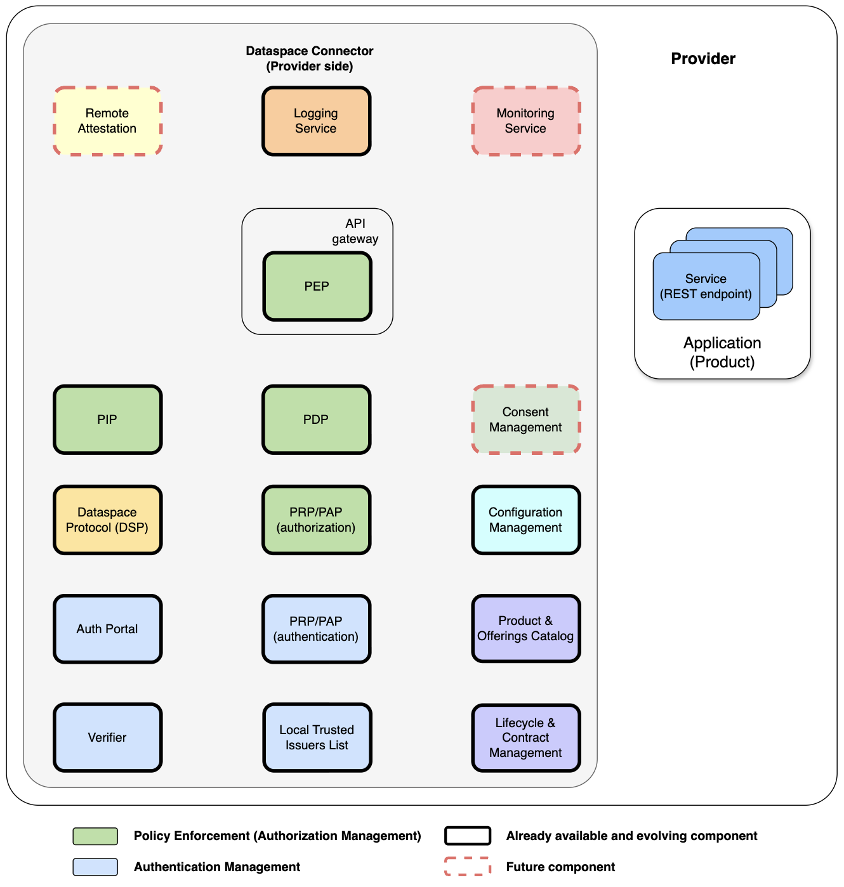

## Overview
 This page describes 

## Basic concepts

A Data Space is defined as a governed ecosystem that facilitates the creation of value around products that offer access to data or data services, while preserving trust between the parties, the sovereignty of each participant, and a seamless experience throughout the processes related to the provision, publication, discovery, contracting, and use of the products.

### Products, services and resources
Any participant in a data space may act in the role of product provider, product consumer, or in both roles. A product comprises a set of data access services, data processing services (including services whose invocation entails the execution of actions), and/or data visualization or interpretation services. The complexity of the products provided in a data space can vary widely, ranging from simple products that consist of access to a specific dataset to sophisticated products that correspond to complete applications implementing multiple data access, data processing, and data visualization or interpretation services. Some of the services associated with a product in the data space are accessible through Application Programming Interfaces (APIs) available at specific points on the internet, while others are accessible through Web-based Graphical User Interfaces (Web GUIs) that end users (natural persons) can access from browsers. The services associated with a given product may require the provision of resources for their execution, both in the cloud (e.g. compute and storage capacity) and at the edge/in the field (e.g. gateways, devices). Some of these resources may need to be provisioned by each organization that has acquired the right to use the services.
Thus, for example, within a data space for the agri-food sector, we may have products that simply offer access to meteorological data or to data related to the use of pesticides by a given farm, but also sophisticated products such as a complete irrigation management application for tomato farms or an application for monitoring livestock herds in extensive livestock farming. Each of these applications may require the provisioning of resources both in the cloud (space for storing data related to each farm) and in the field (devices for measuring moisture and fruit quality or for locating animals, respectively), and may encompass a broad set of services accessible via APIs (for access to data on current and historical measurements as well as access to predictions about the optimal time for irrigation or animal welfare, respectively), as well as through web applications (dashboards, prediction maps, etc.) that facilitate interaction with processing services, as well as the visualization and interpretation of data.

### Decentralized architecture
Users of an organization participating in a data space can consume the data services that other participating organizations offer through different products. Users within an organization that consumes products may be natural persons (for example, staff of the organization or its customers) or software running on devices or systems owned by the organization, which are usually assigned an identity in order to distinguish them from software linked to other devices or implementing different functions.
A principle to be preserved within data spaces is the sovereignty of user management by the organizations that consume data services. They should not be forced to register the identities of the users linked to their organizations in any user management system associated with third-party products whose services they use. Such users must be able to consume the services associated with any product offered in the data space by disclosing only those attributes (credentials) that are required for access to the services to be authorized.
To meet this requirement of sovereignty in user management, data spaces must rely on technologies that support decentralized identity management based on verifiable credentials. The following figure illustrates the entities (which map to components or systems) involved in a management system of this nature, and the interactions between them. On the one hand, users employ components that act as Holders and store the Verifiable Credentials (VCs) that entities known as Issuers assign to them. In the case of natural persons, the component that acts as Holder is implemented as an electronic wallet (digital wallet). When authenticating against a system, a component called a Verifier within that system will request from the Holder component certain VCs required for access to the system. Once the Holder sends them, the Verifier component will verify that the VCs sent have been issued by an Issuer entity that is recognized as a trusted issuing entity for such VCs. To do this, it will confirm that the identifier of the entity that issued the presented VCs is included in the registry of entities recognized as being able to issue those VCs.

The definition of any product that a provider offers in the data space will include the authorization policies governing user access to the data services associated with that product. These policies will be formulated on the basis of credentials that make sense to define and assign to potential users of such services. At this point, when an organization acquires the rights to use the services associated with a given product, that organization will be recognized by the product provider as a trusted issuer of certain credentials defined for the product. The product may, in turn, also recognize users who hold other types of global credentials issued by entities that are recognized for this purpose at a global level within the data space.
Thus, for example, an animal welfare management product may support different authorization policies based on credentials that enable identification of a user as: a manager of a livestock farm, an operator employed at that farm, a veterinarian accredited by the competent authorities to perform audit tasks, or a device connected to the animals (e.g. a collar) to measure animal welfare parameters. When a given livestock farm acquires the right to use the product (subscribes/contracts it), the managers of that farm will issue verifiable credentials for the different categories of employees (manager, operator, etc.) as well as for the devices that measure animal welfare. Meanwhile, veterinarians working for the competent authority will hold credentials issued by that authority. All these users will connect to the services associated with the product to perform the operations they are authorized to carry out.
This model enables users of a given agricultural or livestock operation to authenticate against different products in the data space in a consistent way, regardless of where each product is hosted, providing a seamless experience despite the underlying fully distributed architecture.

### Governance

Governance is an inherent aspect of any data space. From a technical perspective, a data space includes, as part of its governance, an agreement on which interoperability standards to adopt in several key areas:
* **Data exchange and service invocation:** which APIs, protocols, and data models to use for the exchange of (access to) data and for the invocation of services for data processing, visualization, or interpretation.
* **Trust, Identity Management, and Authorization:** which mechanisms to employ to determine trust in participants, manage identities in a decentralized way, and define the authorization policies for access to and use of data or data services that must be applied.
* **Value creation:** which mechanisms to employ for the specification of products and product offerings in the data space, as well as for the discovery and contracting of products, ensuring efficient lifecycle management.

A successful data space strategy requires reaching consensus on the interoperability standards to be adopted in each of these areas. Otherwise, the potential of data spaces to generate value would be very limited.
In addition, a data space includes other governance-related aspects such as the bylaws or rulebook that each participant commits to comply with, which will set out elements such as the legal agreements governing interaction between participants, certain operational requirements (for example, requirements that facilitate traceability/auditability of transactions in case of disputes), and the governing bodies and rules established for decision-making at the overall data space level.

## Data Spaces High-level Architecture
From a global architecture perspective, a data space can be constructed from a set of elements:

* Data Space Connectors, which the organizations participating in the data space must deploy in order to offer data products (a combination of data access, data transfer, data processing, or data visualization/interpretation services) and to interact with participants wishing to consume, in a reliable and secure way, the services associated with those products, under agreed terms and conditions.
* Global Trust Registries, which include, among other things, the registry of participants that have adhered to the established data space governance framework, the registry of trusted issuers of global verifiable credentials assignable to organizations, users and/or products, and the registry of adopted verifiable credential formats/schemas.
* Intermediary systems such as:
    * **Marketplaces**, where product providers can publish specifications of their products (defined as a combination of data and data services), as well as offers defined around those products, and where users can place product orders (which lead to provisioning and/or activation).
    * **Data and Data Service Catalog Publication Platforms**, which collect information about the data and data services offered by organizations and provide means for potential consumers to discover them.
    
Various organizations will participate in the data space. Some of them will act in the role of data product providers, while other organizations (or, more precisely, users and applications associated with those organizations) will act in the role of service consumers, with the possibility that the same organization may assume both roles.

## FIWARE components for Data Spaces

### FIWARE Data Space Connector

The FIWARE Data Space Connector (DSC) brings together a set of open-source software components, some of them developed within the FIWARE Community, that can be integrated to create connectors for data spaces. The following figure shows the main modules that are part of the FIWARE DSC, highlighting both those modules that are already available and those that are on its roadmap. The FIWARE DSC architecture includes modules that comprise various components and implement the following functions:
* **Authentication**, which supports the authentication of both organizations and users of the services associated with the products accessible through the connector (whether end users, i.e. individuals, or software running on devices and applications, including software agents such as AI – Artificial Intelligence – agents);
* **Authorization**, which determines, based on established policies, whether a previously authenticated user may access a given data service, by evaluating information (credentials) about the user, the requested service, the fields or properties of the data to be accessed or processed, environmental parameters, or the results of invoking intermediary services with data from the request (for example, personal data intermediary services that determine whether a user has registered consent for the access or use of certain personal data requested in the call);
* **Product and Offerings Catalog (Catalog)**, which provides access to specifications of products (including the specifications of the data services associated with the product and the resources required for the execution of those services) accessible through the connector, as well as offers related to them;
* **Product Contract and Lifecycle Management**, which implements both the processes for contracting a product accessible through the connector—covering contract negotiation processes and acquisition of usage rights (product ordering) for the products by organizations or users interested in consuming those services—and the management of their lifecycle, including states related to product provisioning and activation;
* **DSP (Dataspace Protocol) Compatibility Module**, which enables interoperability with connectors that implement the DSP protocols defined by Eclipse/IDSA: Catalog, Contract Negotiation, Transfer Process;
* **Logging and Traceability**, which stores information about the different steps executed in the course of transactions mediated by the connector for audit or debugging purposes;
* **Monitoring**, which allows the operation of the connector to be monitored, handling concepts specific to the connector itself rather than only low-level logs;
* **Remote Attestation**, which makes it possible to verify the software deployed within the connector.

FIWARE DSC is conceived fundamentally as the integration of these modules based on deployment recipes (Helm Charts) for their deployment in Kubernetes environments, whether on participants’ servers (deployed in turn in Cloud environments or on their own infrastructure, i.e. on-premise) or in intermediary environments that implement the concept of Data Space Connector as a Service (DSCaaS) or Data Space as a Service (DSaaS).
Within any data space, it is important to establish interoperability standards for the authentication, authorization, catalog, and product contract and lifecycle management modules. The following table summarizes the reference standards and specifications implemented by FIWARE DSC.

|Module / functionality| Reference specifications |
|----|----|
| **Global standard references**||
| Decentralized Identity | W3C Decentralized IDentifiers (DIDs)|
| Verifiable Credentials (VC)s | W3C Verifiable Credentials (VCs) |
| **Authentication module** | |
| Interface with Trush Anchor services | EBSI Trusted Issuers Registry API |
| Protocols for issuance and exchange of VCs | OpenID OID4VC (SIOPv2, OID4VP) |
| **Authorization module** | |
| Authorization policy definition language | W3C ODRL, Gaia-X ODRL VC profile |
| | |
| Products and Offerings Catalog module | TM Forum Open APIs, DCATv3 |
| Product Contract Negotiation and Lifecycle Management module | TM Forum Open APIs |

In addition to the open reference standards mentioned above, FIWARE DSC incorporates a module that enables compatibility with connectors that use the components of the Dataspace Protocol (DSP), initially defined by IDSA and currently managed under the umbrella of the Eclipse Dataspace Working Group (EDWG).
It is important to note that FIWARE DSC enables direct access to a product’s services by users associated with any organization that has acquired the right to use that product, without requiring a connector to be deployed in that organization or for each user. These users may be employees or customers of the organization in question, but they may also be devices or software agents, all of them having an identity that distinguishes them within the organization. Users only need a system for storing their Verifiable Credentials (VCs) which, in the case of individuals, will be a digital wallet compatible with the guidelines set by the European Union (see the EU Digital Identity Wallet Architecture and Reference Framework).
FIWARE DSC is agnostic with respect to the REST API implemented by the provider of a product that offers services through the connector. In this sense, the connector can mediate access to services that a given product may offer through APIs such as:
* **S3**, for transferring large volumes of data—for example, to upload historical data to the provider of a product that delivers prediction services based on Machine Learning (ML) techniques for training predictive models.
* **NGSI-LD or NGSIv2**, to access or modify properties of digital twins (context entities) or attributes linked to digital product passports, either via queries or subscriptions for receiving notifications upon changes.
* **MCP, A2A or ACP**, for accessing AI agent functionalities or context information suitable for consumption by AI agents.

### FIWARE Marketplace

A Global Marketplace service may be part of the data space, where product providers will be able to register specifications of their products and offers built around them. Organizations interested in using products offered within the framework of the data space (for example, agricultural or livestock holdings) will be able to access this marketplace to review the available product offers, select those products that best fit their needs, potentially negotiate the terms of the offers defined for those products (contract negotiation), and finally acquire the right to use them (product ordering).
The Global Marketplace interacts with the deployed connectors that mediate access to the products offered in the data space. Interaction between the Global Marketplace and the connector that mediates access to a given product takes place during the negotiation of the product’s terms of use (if the product provider allows such negotiation) and always during the establishment of the contract between the consuming organization that acquires the right to use the product and the product provider (product ordering). As a result, the consuming organization is registered in the product’s connector as a trusted issuer of VCs linked to the product.
The Global Marketplace for the data space will be implemented as an instance of the FIWARE BAE (Business Application Ecosystem) product, developed as open-source software within the FIWARE Community. This product integrates all the components required to build marketplaces around digital products of different kinds, including data and complete applications. The FIWARE BAE product is based on the TM Forum Open API specifications, which support management of catalogs of product specifications and product offers, as well as the management of all the steps required for product contracting.
The FIWARE BAE product has been adopted as the basis for the main marketplace of the European Union created within the DOME project, one of the flagship projects under the Digital Europe programme, whose aim is to deploy infrastructure that enables the federation of multiple marketplaces through which products can be offered that run in the cloud, at the network edge, or in a combination of both environments. Products registered in the catalog associated with DOME’s main marketplace can be automatically imported from the catalogs associated with any of the marketplaces federated in DOME, which act as channels through which to connect with potential consuming organizations. 
